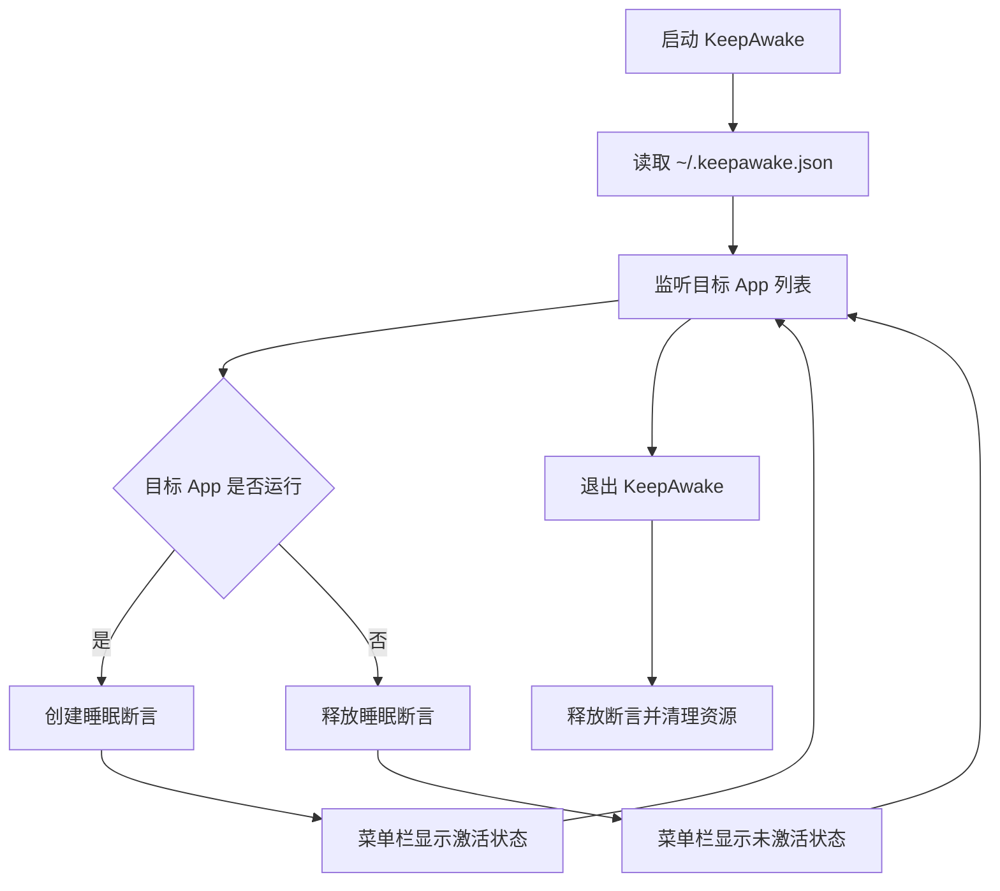
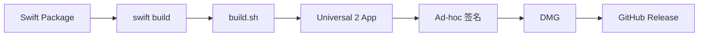

# KeepAwake 项目流程图

## 应用运行流程

```mermaid
flowchart TD
    A[启动 KeepAwake] --> B[读取 ~/.keepawake.json]
    B --> C[监听目标 App 列表]
    C --> D{目标 App 是否运行}
    D -->|是| E[创建睡眠断言]
    D -->|否| F[释放睡眠断言]
    E --> G[菜单栏显示激活状态]
    F --> H[菜单栏显示未激活状态]
    G --> C
    H --> C
    C --> I[退出 KeepAwake]
    I --> J[释放断言并清理资源]
```

## 构建发布流程

```mermaid
flowchart LR
    A[Swift Package] --> B[swift build]
    B --> C[build.sh]
    C --> D[Universal 2 App]
    D --> E[Ad-hoc 签名]
    E --> F[DMG]
    F --> G[GitHub Release]
```

合盖保活、管理员授权和真实睡眠行为必须在真实 Mac 上验证，不能只以编译成功作为完成标准。
